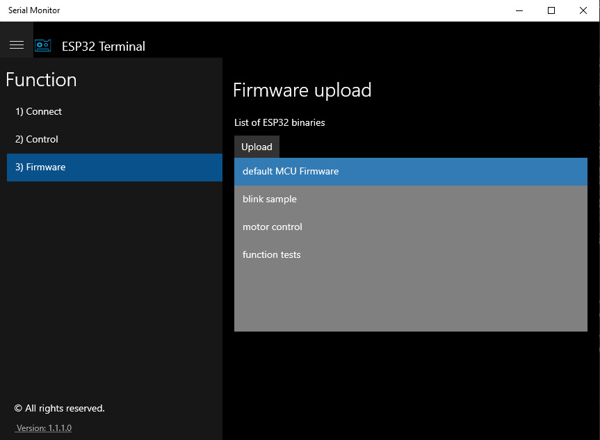

[What's new in C#](https://docs.microsoft.com/de-de/dotnet/csharp/whats-new/csharp-9)
# .NET6 - C#10 Snippets
* Record Struct
* Dependency Injection
# .NET5 - C#9 Snippets
* Delegates
* LambdaExpression
* Generic
* Records Class
* Pattern matching
* Action
# Design Pattern
* Factory 
* Observer
# UWP Experiments
* connect Esp32 serial device RS232, USB or Bluetooth
 |  |
| 
